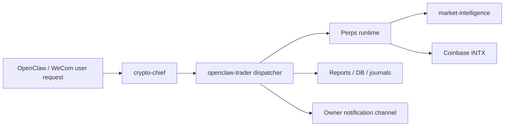

# System Overview

## Active Production Path

The active production path is:

This repository is the trading runtime and dispatcher. It is not the full OpenClaw application, but it assumes an external agent environment exists and can call back into the trader runtime.

## Core Components

### Local runtime

- Lives under `~/.openclaw-trader/`
- Stores config, reports, state database, logs, runtime files, and secrets
- Is the source of truth for live behavior

### `openclaw-trader`

- Provides the FastAPI service and `otrader` CLI
- Builds market state, risk state, strategy context, and trade execution plans
- Maintains briefs, journals, and maintenance jobs

### Dispatcher

- Polls the current market and runtime state
- Decides whether to refresh strategy, run execution judgment, emit notifications, or stay idle
- Delegates expert reasoning to external OpenClaw agents instead of embedding all strategy writing in-process

### Perps runtime

- The active execution path is Coinbase INTX perpetuals
- Tracks BTC and ETH by default
- Converts strategy targets and signal/risk context into concrete open, add, reduce, close, or flip plans

### Market intelligence

- Lives inside the perp runtime as the local prediction and calibration subsystem
- Produces fee-aware direction probabilities, trade-quality estimates, regime labels, and calibrated execution thresholds
- Trains three fixed horizons in parallel: `1h`, `4h`, and `12h`
- Produces a live-read policy overlay plus event-action, portfolio-risk, and model-uncertainty summaries
- Stores model artifacts and calibration reports under the local runtime, not in git
- Feeds compact model status into strategy inputs without exposing full artifact internals to the LLM

### External agent layer

- `crypto-chief` acts as the reasoning and decision-writing layer
- Owner notifications are sent through an external channel configured in runtime config
- Session names are not the stable identity; agent id and reply routing are

## Source-of-Truth Order

For live behavior, use this order:

1. Runtime config in `~/.openclaw-trader/config/`
2. Runtime reports and state in `~/.openclaw-trader/reports/` and `~/.openclaw-trader/state/`
3. Repository defaults in `src/openclaw_trader/config.py` and `src/openclaw_trader/bootstrap.py`
4. Historical notes or memory documents

This matters because the public repository intentionally keeps generic defaults, while a private deployment overrides them locally.

## What Is Still Transitional

Some spot-era and secondary-adapter code still exists:

- spot-oriented endpoints and CLI commands
- compatibility naming such as equity-style percentage field names
- a Hyperliquid adapter

These remain in the repository, but the intended production path is Coinbase INTX live perpetuals.

## Design Intent

The system is designed around a few explicit constraints:

- keep mutable runtime state outside git
- let strategy define target exposure, not raw imperative orders
- keep risk controls local and deterministic even when LLM reasoning is involved
- let market-intelligence improve signal quality, timing, and sizing without changing the outer runtime contract
- allow automated dispatch without pinning the system to a single long-lived chat session
- send human-readable owner notifications without leaking raw execution-decision payloads
