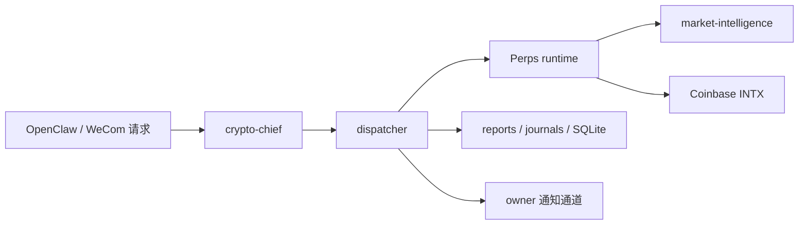

# 当前系统基线

本文件只描述“现在系统真实是什么”，不描述理想状态。

## 1. 当前生产主路径

## 2. 当前真相源顺序

当前系统的 live 行为不是由 git 仓库单独决定，而是由下列顺序决定：

1. `~/.openclaw-trader/config/*.yaml`
2. `~/.openclaw-trader/reports/*` 与 `~/.openclaw-trader/state/trader.db`
3. 仓库内 `src/openclaw_trader/config.py` 与 `bootstrap.py`
4. 历史记忆文档与人工说明

这意味着：仓库代码是“规则与默认值”，本地运行态才是“真实行为”。

## 3. 当前代码入口

### 3.1 运行入口

- CLI 入口：`src/openclaw_trader/cli.py`
- FastAPI 入口：`src/openclaw_trader/service.py`
- 调度入口：`src/openclaw_trader/dispatch/__init__.py`
- 永续执行运行时：`src/openclaw_trader/perps/runtime/__init__.py`

### 3.2 主要功能目录

- `dispatch/`：编排、执行判断、通知、brief、OpenClaw 适配
- `strategy/`：策略输入、解析、持久化、重写调度
- `market_intelligence/`：多时域模型、事件政策、上下文聚合
- `perps/`：交易所适配与永续运行时
- `news/`：新闻采集与轮询
- `state.py`：SQLite 状态存储
- `briefs.py`：可读 brief / report 输出

## 4. 当前系统已经具备的能力

### 4.1 市场与交易能力

- Coinbase INTX 永续账户读取
- 永续行情快照与 K 线读取
- paper / live 开平仓
- 风险检查与 panic 保护
- BTC/ETH/SOL 多币支持

### 4.2 量化与策略能力

- `1h / 4h / 12h` 多时域预测
- base model + regime + trade-quality 组合判断
- 硬风控边界 / `event_action` / `portfolio_risk` / `model_uncertainty`
- daily strategy 重写
- 执行判断

### 4.3 调度与对外交互能力

- `dispatch-once`
- `run-dispatcher`
- `strategy-refresh`
- OpenClaw agent 调用
- owner 通知
- brief / report / journal

## 5. 当前系统的结构性问题

### 5.1 编排逻辑过于集中

`dispatch/__init__.py` 与 `perps/runtime/__init__.py` 已经承担了过多职责：状态评估、策略上下文、执行判断、通知、执行和异常兜底都在大文件里发生。

### 5.2 真相源不止一个

当前系统同时依赖：

- SQLite
- `reports/*.json|md`
- runtime YAML
- OpenClaw transcript / session
- 日志文件

这些来源都重要，但还没有被统一成显式真相模型。

### 5.3 LLM 信息源仍由多处手工拼接

当前策略输入、执行判断输入、brief 和通知文本由多个模块分别组装，尚未形成统一的上下文构建层与上下文视图体系。

### 5.4 当前没有显式状态机收口层

系统虽然事实上存在 `heartbeat -> strategy -> execution_judgment -> execution` 这条流程，但状态迁移并没有完全独立成单一模块，仍然散在 dispatcher、runtime 与策略模块中。

### 5.5 结构化事件不足

当前有 brief、report、journal 和 SQLite，但没有统一的事件 envelope；这会限制前端实时动画、历史回放和多模块追踪。

## 6. 当前模块与未来模块之间的错位

当前代码是“功能存在，但边界不稳定”。例如：

- `market_intelligence/policy.py` 既像量化判断，又像风控守卫
- `strategy/__init__.py` 同时承担策略语义、上下文构建、记忆与报表
- `dispatch/__init__.py` 同时承担状态推进、OpenClaw 集成、通知与执行桥接
- `briefs.py` 部分承担了未来前端 / 回放的数据准备职责

这也是本轮蓝图必须先做“拆解与归类”的直接原因。
