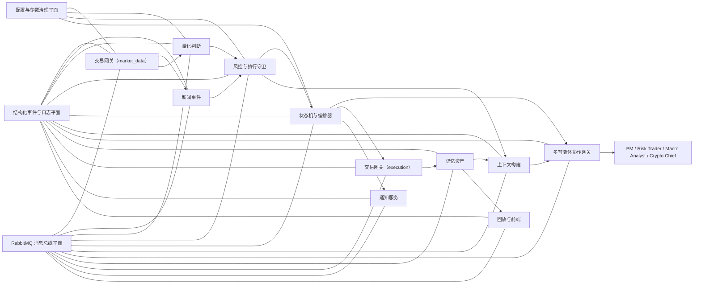

# 目标架构总图

> **迁移说明（2026-03-15）**：模块与 Agent 的主真相层已迁移到 `specs/modules/` 与 `specs/agents/`。本文件继续保留为蓝图总图与迁移背景，不再单独充当模块边界的最高真相源。

## 1. 顶层业务模块

系统目标拆为 10 个顶层业务模块：

1. 交易网关模块
2. 新闻事件模块
3. 量化判断模块
4. 风控与执行守卫模块
5. 状态机与编排器模块
6. 上下文构建模块
7. 多智能体协作网关模块
8. 记忆资产模块
9. 通知服务模块
10. 回放与前端模块

### 1.1 2026-03-12 收敛决议

原先拆分的“数据接入与标准化模块”与“账户与下单模块”不再作为两个并列顶层模块存在。

新的目标边界改为：

- 顶层统一为 `交易网关模块`
- 模块内部再拆成两个清晰子域：
  - `market_data`：市场、账户、持仓、产品元数据读取与标准化
  - `execution`：订单执行、回报、预检、查询

本决议只改变顶层模块边界，不改变“读事实”和“写动作”必须继续分离的原则。

### 1.2 2026-03-12 交易网关信息收集扩展决议

`Trade Gateway` 后续要覆盖尽可能完整的交易所侧信息收集渠道，但仍然不接管新闻事件采集；新闻继续由“新闻事件模块”负责。

`market_data` 子域后续应覆盖两类信息：

- 交易所直接事实
  - 多尺度 K 线与价格序列
  - 市场快照：价格、成交量、资金费率、溢价、未平仓量
  - 账户快照、持仓、组合、产品元数据
  - 最近订单与成交历史
  - 视情况接入最优买卖价、订单簿与深度
- 基于交易所原始事实本地派生的上下文
  - 最近 `15m / 1h / 4h / 24h` 的压缩价格序列
  - 价格形态摘要
  - 关键价位
  - 突破 / 回踩状态
  - 波动扩张 / 收缩状态

`execution` 子域后续除执行本身外，还应补齐执行侧信息面：

- 最近执行结果与失败原因
- 失败原因聚合统计
- 执行预检、预览、回执与重试结果

定时采集由“状态机与编排器模块”统一驱动；其他模块允许按需单次调用 `Trade Gateway` 获取最新事实。

## 2. 三条跨域平面

### 2.1 结构化事件与日志平面

负责统一事件 envelope、trace、日志格式、事件持久化与前端观察基础。

### 2.2 RabbitMQ 消息总线平面

负责模块间异步协作、Agent 请求回执、命令流、执行回报和通知派发。

### 2.3 配置与参数治理平面

负责参数版本、人工调参、作用域、生效时间、回滚与审计。

## 3. 四个 Agent

- `PM`：负责形成目标组合并正式提交 `strategy`
- `Risk Trader`：负责执行判断、下单时机选择与临场执行建议
- `Macro & Event Analyst`：负责新闻、事件和宏观整理
- `Crypto Chief`：负责 owner 沟通、复盘、Learning、升级处理

## 4. 总体交互图

## 5. 分层关系

### 5.1 核心决策域

- 交易网关
- 新闻事件
- 量化判断
- 风控与执行守卫
- 状态机与编排器

### 5.2 支撑域

- 上下文构建
- 多智能体协作网关
- 记忆资产

### 5.3 交付域

- 通知服务
- 回放与前端

## 6. 最重要的架构原则

- LLM 与 Agent 不是核心规则持有者，而是受约束协作层。
- 所有主动入口统一收口在状态机与编排器模块。
- 回放与前端依赖的是结构化事件，而不是拼接文本日志。
- OpenClaw 是外部协作环境，不是系统内部核心域。
