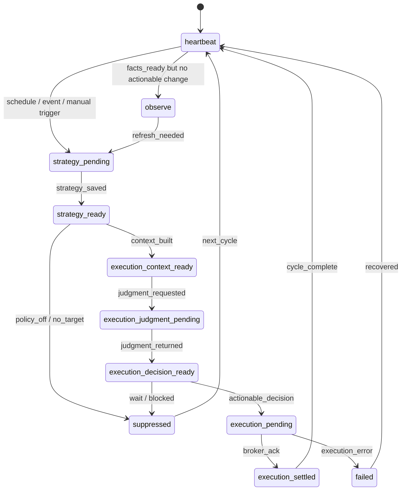

# 统一状态机

## 1. 目标

把当前散落在 dispatcher、strategy flow、执行判断链和 execution 中的流程，统一收口成显式状态机。

## 2. 主状态

## 3. 状态说明

| 状态 | 含义 | 进入条件 | 主要输出 |
| --- | --- | --- | --- |
| `heartbeat` | 心跳状态，无待执行动作 | 周期启动或流程结束 | 简要状态快照 |
| `observe` | 观察状态，暂不进入策略或执行 | 市场事实存在但不满足动作条件 | observe 事件 |
| `strategy_pending` | 等待生成 / 更新策略 | 定时、事件、手动触发、fallback | 策略任务 |
| `strategy_ready` | 策略已经更新或确认无变化 | 策略文档落盘 | 策略意图事件 |
| `execution_context_ready` | 执行上下文已生成 | 策略与事实均已齐备 | execution context 事件 |
| `execution_judgment_pending` | 等待 Risk Trader 或 fallback 给出执行判断 | 已请求执行判断 | judgment 请求 |
| `execution_decision_ready` | 执行判断已返回 | 执行决策落盘 | execution decision 事件 |
| `execution_pending` | 等待执行层提交订单 | 决策可执行且 guard 通过 | execution command |
| `execution_settled` | 执行完成 | 交易所回执或 paper 回执成功 | execution result 事件 |
| `suppressed` | 被政策、风险或条件压制或选择 wait | `policy_off`、`decision_wait` 等 | suppression 事件 |
| `failed` | 流程失败 | 数据、网络、执行或 Agent 错误 | failure 事件 |

## 4. 迁移原因（Transition Reason）

每次状态切换必须带原因码。建议最少包含：

- `scheduled_refresh_due`
- `manual_trigger`
- `major_event_detected`
- `policy_off`
- `execution_context_built`
- `execution_decision_ready`
- `execution_decision_wait`
- `execution_succeeded`
- `execution_failed`
- `runtime_data_unavailable`

## 5. 统一外部主动触发入口

状态机与编排器模块必须暴露唯一主动控制入口，例如：

- `POST /api/control/commands`

命令类型示例：

- `refresh_strategy`
- `rerun_trade_review`
- `dispatch_once`
- `replay_window`
- `sync_news`
- `retrain_models`
- `emit_daily_report`
- `resume_panic_lock`

注：`rerun_trade_review` 是兼容命令名，语义上对应重跑执行判断。

所有主动触发都必须：

1. 先写入 `ManualTriggerCommand`
2. 产生结构化事件
3. 通过状态机推进，而不是直接跳过流程调用底层模块

## 6. 当前系统与未来状态机的对应关系

当前系统已有的隐式状态映射如下：

- `AutopilotPhase.heartbeat` -> `heartbeat`
- `AutopilotPhase.observe` -> `observe`
- `strategy-refresh` 执行中 -> `strategy_pending`
- strategy doc 落盘后 -> `strategy_ready`
- `decision.phase == trade` 且有合法执行上下文 -> `execution_context_ready`
- `trade_review` 兼容命令名触发执行判断 -> `execution_judgment_pending`
- 执行判断 payload 返回 -> `execution_decision_ready`
- `execute_trade_batch` -> `execution_pending`
- 下单结果写 journal / DB -> `execution_settled`

未来应把这些对应关系显式化，不再只留在代码路径里。
