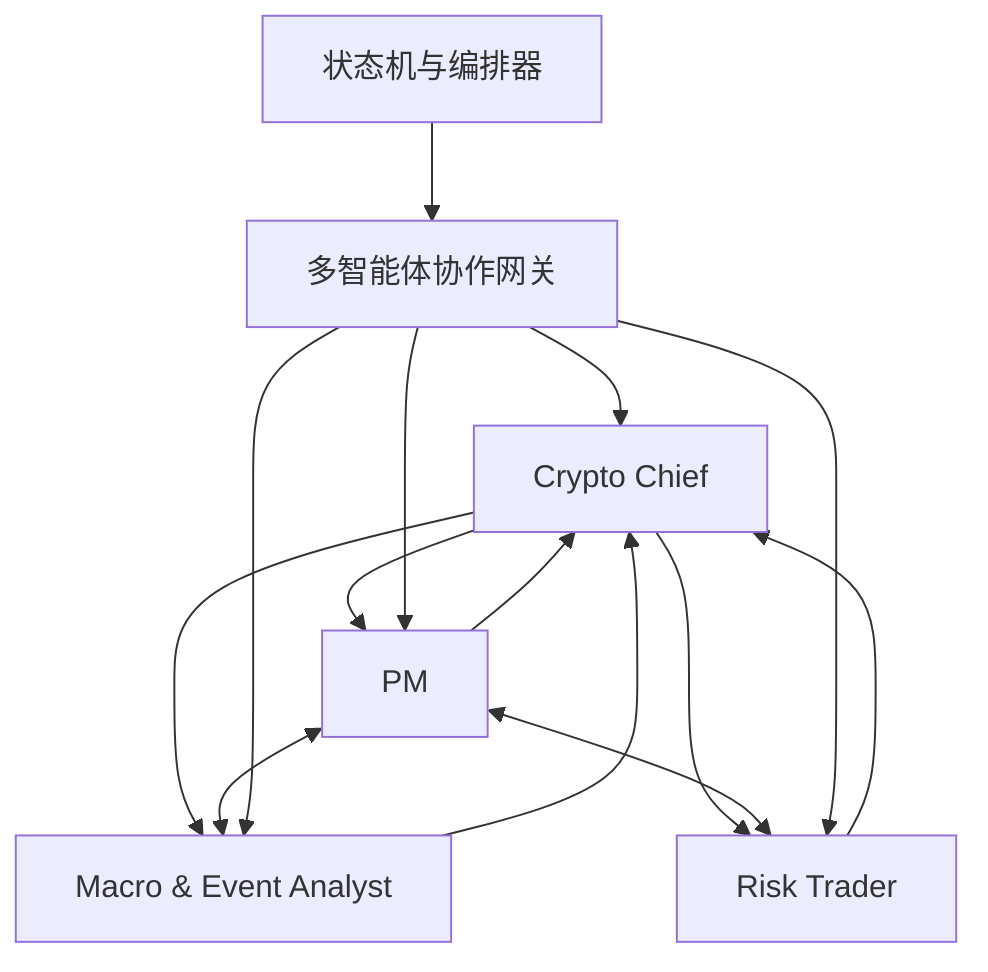

# 多智能体拓扑

> **迁移说明（2026-03-15）**：Agent 级主真相层已迁移到 `specs/agents/README.md`。本文件继续保留为蓝图拓扑和迁移背景，不再单独充当 Agent 工作方式的最高真相源。

## 1. 组织结构

## 2. 各 Agent 职责

### 2.1 PM

- **负责**：策略生成、策略更新建议、策略解释
- **输入**：PM 策略视图
- **输出**：正式 `strategy` 提交
- **不负责**：直接下单、直接写通知、最终风控覆盖

### 2.2 Risk Trader

- **负责**：高频执行判断、临场执行时机选择、执行前理由说明
- **输入**：Risk Trader 执行视图
- **输出**：按币种组织的结构化执行决策
- **不负责**：生成长期策略、改写风险边界

### 2.3 Macro & Event Analyst

- **负责**：新闻、事件、宏观背景整理，以及对其他 Agent 的必要提醒
- **输入**：新闻 / 事件视图
- **输出**：结构化事件结果、即时提醒、需 Chief 决策的问题
- **不负责**：给目标仓位、直接下单

### 2.4 Crypto Chief

- **负责**：owner 沟通、Learning、复盘、升级事项处理、综合判断汇总
- **输入**：Chief 统筹视图、下级 Agent 升级请求
- **输出**：对 owner 的回复、复盘记录、Learning 条目
- **不负责**：替代下级 Agent 做所有一线任务

## 3. 自主性边界

| Agent | 可自主做什么 | 不可越过的边界 |
| --- | --- | --- |
| PM | 在策略边界内给目标组合意图 | 不能突破风控与硬上限 |
| Risk Trader | 在 `ExecutionContext` 和硬边界内产出执行决策 | 不能绕过硬风控、不能裸下单 |
| Macro & Event Analyst | 升级或降级事件认知 | 不能直接修改策略和仓位 |
| Crypto Chief | 与 owner 沟通、做复盘和升级协调 | 不能替代本地规则成为唯一真相源 |

## 4. 协作原则

- Agent 间允许直接沟通提醒、追问、澄清与升级，不必全部经由状态机与编排器中转。
- 直接沟通不是系统真相；只有正式结构化提交进入对应模块并写入 `memory_assets` 后，才算系统内有效结果。
- 角色特定的 JSON 输出约束只作用于正式提交通道，不约束 Agent 间直接沟通。

## 5. 升级规则

- 任一 Agent 遇到输出契约不满足、上下文矛盾、权限不足、需要 owner 决策时，都必须升级给 Crypto Chief。
- Crypto Chief 可以把问题回派给对应专职 Agent，但不能把未解决的升级问题直接沉没。
- 所有升级都必须产生 `agent.escalation.raised` 事件，并进入状态与记忆管理模块。

## 6. 与当前系统的对应关系

当前仓库实际上主要只有一个外部行为主体：`crypto-chief`。  
未来多 Agent 化不是增加“更多 prompt”，而是把当前已经混在 `crypto-chief` 内的多种角色拆开：

- 策略生成 -> PM
- execution judgment -> Risk Trader
- 新闻理解 -> Macro & Event Analyst
- owner 沟通 / Learning -> Crypto Chief
